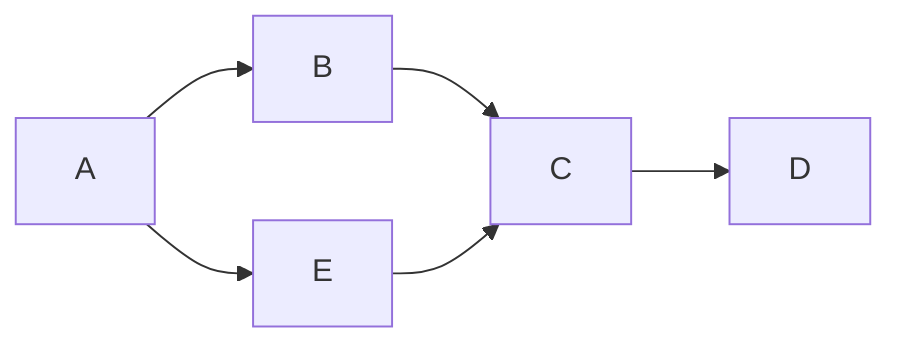
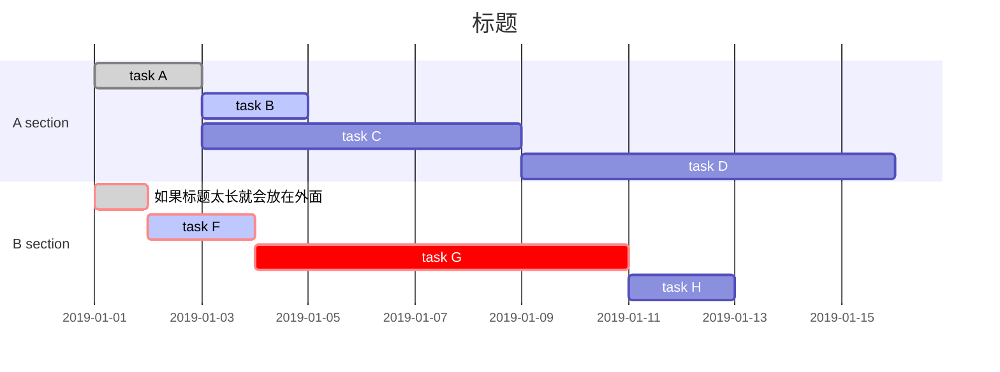

# Markdown

# 标题
# 一级标题
## 二级标题
### 三级标题{#1}
#### 四级标题
##### 五级标题
###### 六级标题
# 无序列表
- 文本1
- 文本2
- 文本3
# 有序列表
1. 文本1
2. 文本2
3. 文本3
# 超链接
[百度](https://www.baidu.com/)
# 引用
> 被引用内容
>> 第二层
>>> 第三层
# 代办清单To-do List
- [x] 已完成项目1
  - [x] 已完成事项
  - [x] 代办事项
- [ ] 代办项目2
- [ ] 代办项目3
# 表格
使用 | 来分隔不同的单元格，使用 - 来分隔表头和其他行
- :--- 代表左对齐
- :--: 代表居中对齐
- ---: 代表右对齐

a | b | c 
-|:-:|-:
1 | 2 | 3 
11 | 22|33
111 | 222|333

#### 流程图

#### 甘特图

